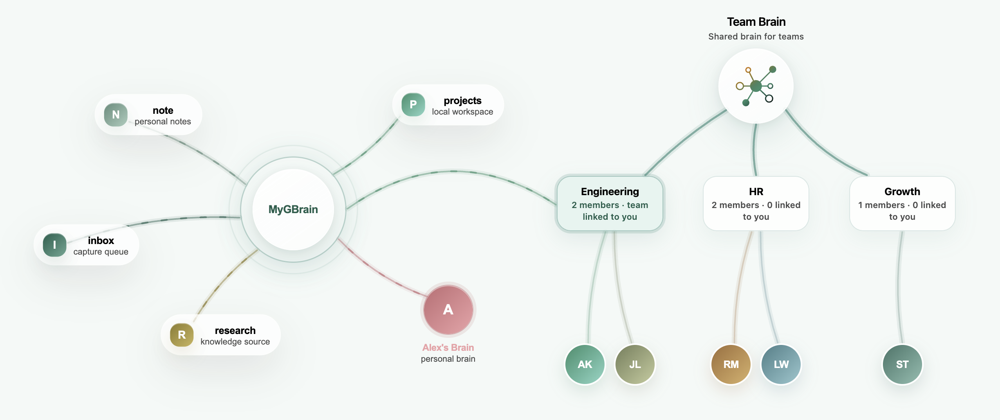

# OpenBrain

[中文 README](./README.zh-CN.md)

> **GBrain, ready to use.**

OpenBrain gives GBrain a GUI and agent runtime.

[Download](https://openbrain.chat/download) · [Website](https://openbrain.chat) · [GitHub](https://github.com/colinagent/openbrain)

## Connect other GBrains

Connect sources and peer brains. In practice, connected brains are queried on demand as subagents.



## GBrain Agent

**Use GBrain as a subagent**

Keep your main agent focused.

## Ready to use. Zero setup.

Download OpenBrain and start with GBrain — no extra wiring.

[Download OpenBrain](https://openbrain.chat/download)

## Repository layout

- `agents/`: built-in product agents. `agents/coder` is the default coding
  agent; `agents/gbrain` is the GBrain-backed knowledge agent.
- `tools/`: MCP tool packages. `tools/gbrain-cloud` exposes OpenBrain Cloud
  GBrain MCP to agents; shell/read/write/edit are runtime built-ins.
- `desktop/`: OpenBrain Electron desktop app.
- `server/`: local OpenBrain server used by the desktop app.
- `opagent-runtime/`: public OpAgent runtime packages and runtime entrypoints.
- `opagent-protocol/`: public OpAgent protocol SDKs.
- `scripts/openbrain/`: public build and release helpers.
- `docs/runtime.md`: runtime design.
- `docs/subagent.md`: subagent design.
- `docs/desktop.md`: desktop app usage and settings.

## Development

Go modules are linked locally by the root `go.work`; public module files should
not contain local-path `replace` directives.

```bash
(cd opagent-runtime && go test ./...)
(cd server && go test ./...)
(cd opagent-protocol/go-sdk && go test ./...)
(cd agents/coder && go test ./...)
(cd desktop && npm ci && npm run build)
```

The repository root is a `go.work` workspace and is not itself a Go module, so
run Go tests from the module directories above.

For runtime or subagent changes, read [docs/runtime.md](docs/runtime.md) and
[docs/subagent.md](docs/subagent.md) first. For desktop settings and behavior,
see [docs/desktop.md](docs/desktop.md).

## Releases

OpenBrain release builds are available from GitHub Releases. Runtime
self-update manifests, runtime bundles, bootstrap binaries, and desktop update
metadata use the GitHub Release by default.

## License

This repository uses multiple licenses:

- **AGPL-3.0** — OpenBrain components: `desktop/`, `server/`, `agents/`,
  `tools/`, `opagent-runtime/`, `opagent-protocol/`, `docs/`, and
  `scripts/openbrain/`. See [LICENSE](LICENSE) and [NOTICE](NOTICE).
- **MIT** — GBrain itself is an external project. OpenBrain release helpers can
  package binaries built from the `colinagent/gbrain` fork, which tracks
  `garrytan/gbrain`.

If you modify or distribute OpenBrain code, you must comply with AGPL-3.0
(including source availability when required) and retain attribution to
OpenBrain as described in NOTICE. Copyright is held by OpAgent Inc.
