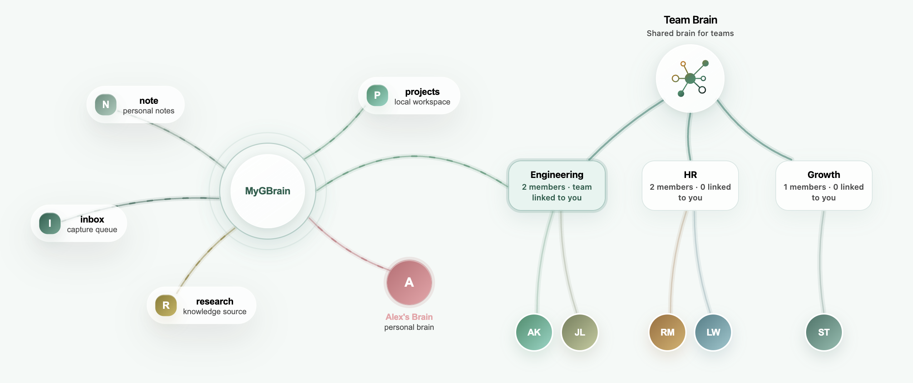

# OpenBrain

[English README](./README.md)

> **GBrain, ready to use.**

OpenBrain 通过开放的 agent runtime 为 GBrain 提供桌面体验。

[下载](https://openbrain.chat/download) · [官网](https://openbrain.chat) · [GitHub](https://github.com/colinagent/openbrain)

## 点击连接他人的 GBrain

在图中连接 source 和同事大脑。实际使用时，连接的大脑通过 subagent 按需查询。



## GBrain Agent

**把 GBrain 当成 subagent**

让主 agent 保持专注。

## 开箱即用，零配置

下载 OpenBrain，装上就能用 GBrain。

[下载 OpenBrain](https://openbrain.chat/download)

## 仓库结构

- `agents/`：内置产品 agent。`agents/coder` 是默认 coding agent；`agents/gbrain` 是基于 GBrain 的知识 agent。
- `tools/`：MCP 工具包。`tools/gbrain-cloud` 向 agent 暴露 OpenBrain Cloud GBrain MCP；shell/read/write/edit 是 runtime 内置能力。
- `opagent-runtime/`：公开 OpAgent runtime 包与入口。
- `opagent-protocol/`：公开 OpAgent 协议 SDK。
- `scripts/openbrain/`：通用 runtime/package 构建脚本。
- `docs/runtime.md`：runtime 设计。
- `docs/subagent.md`：subagent 设计。

OpenBrain Desktop 及其协作的本地 server 仍会以产品形式分发，但实现为
闭源代码，不属于本源码仓库。

## 开发

根目录 `go.work` 在本地链接 Go module；公开 module 文件不应包含本地路径 `replace`。

```bash
(cd opagent-runtime && go test ./...)
(cd opagent-protocol/go-sdk && go test ./...)
(cd agents/coder && go test ./...)
```

仓库根目录是 `go.work` workspace，本身不是 Go module，请在上述 module 目录中运行 Go 测试。

修改 runtime 或 subagent 前，请先阅读 [docs/runtime.md](docs/runtime.md) 和 [docs/subagent.md](docs/subagent.md)。

## 发布

即使源码闭源，OpenBrain Desktop 安装包仍继续通过 GitHub Releases 公开下载。每个产品 Release 主动上传的资产只包括 macOS、Linux、Windows 三个平台的 Desktop 安装包。Runtime 自更新 manifest、runtime bundle、bootstrap 二进制和桌面更新元数据由公开下载入口 `https://download.op-agent.com` 提供。

## 许可证

本仓库使用多种许可证：

- **AGPL-3.0** — 本仓库中的源码：`agents/`、`tools/`、`opagent-runtime/`、`opagent-protocol/`、`skills/`、`docs/`，以及 `scripts/openbrain/` 下的通用辅助脚本。见 [LICENSE](LICENSE) 与 [NOTICE](NOTICE)。
- **专有软件** — OpenBrain Desktop 与本地 server 独立分发，其源码不由本仓库授权。
- **MIT** — GBrain 本身是外部 `garrytan/gbrain` 项目。OpenBrain release 辅助脚本直接构建上游源码，或使用与上游完全一致的 `colinagent/gbrain` 二进制镜像。

如果你修改或分发 OpenBrain 代码，必须遵守 AGPL-3.0（包括在要求时提供源码），并按 NOTICE 保留 OpenBrain 署名。版权归 OpAgent Inc. 所有。
