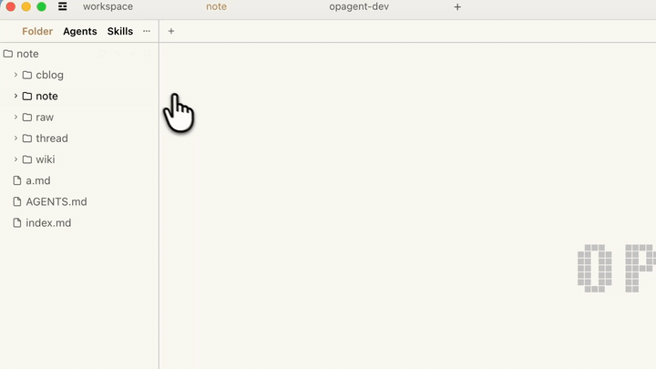
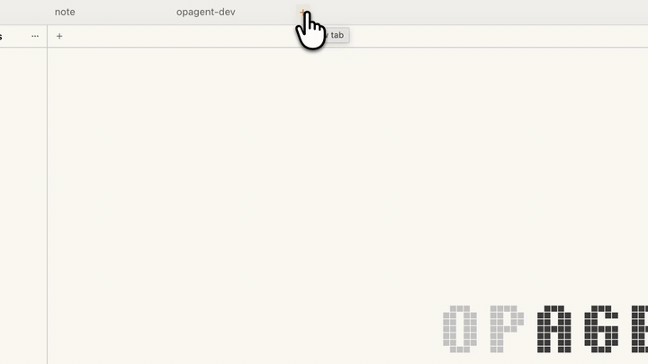

# OpAgent

English | [简体中文](README.zh-CN.md)

OpAgent is The AgentOS runtime used by OpenBrain.

An operating system connects you and your apps. OpAgent connects you and your AI
agents. Everything is a file, and agents live in your folders.

OpAgent is built around a visible, file-native agent workspace: conversations,
tools, skills, knowledge, and file changes stay inside the workspace instead of
being hidden behind a chat box.

## Product Features

### Agents Live In Your Folders

Agents stay close to the files, tools, and context they work with. A folder can
carry its own agent setup instead of depending on a detached chat surface.



### See Exactly What Your Agents Changed

Every file change is shown as a clean diff. Accept, edit, or revert the change;
you stay in control of what lands in your workspace.


### Everything About Your Agents, Visible And Manageable

Conversations, tools, skills, and knowledge live in one workspace. The agent
environment is inspectable and manageable instead of hidden behind a chat box.


### Conversations That Do Not Disappear

Every conversation becomes a Markdown file you can edit, search, version, and
reuse instead of losing it in a long chat history.


### One Agent Environment For Local And Remote Work

Your model configs travel with you, and agents install as needed. Remote work
does not require rebuilding the same setup on every machine.



### Markdown Is The Interface

Live preview, tables, Mermaid diagrams, frontmatter, and source text stay close
together. The document is both the interface and the durable record.


## This Repository

This directory contains the open-source OpAgent runtime code required to build
and test the local OpenBrain runtime process.

Private deployment scripts, credentials, hosted-service internals, and
release-only private assets do not belong here.

## Repository Layout

- `cmd/opagent-runtime`: runtime entrypoint.
- `cmd/opagent-bootstrap`: bootstrap and updater entrypoint.
- `internal`: runtime implementation.
- `packages/ai`: canonical AI history, provider adapters, replay helpers, and
  streaming support.
- `../docs/runtime.md`: public runtime design.

## Build

```bash
go build ./cmd/opagent-runtime
```

## Test

```bash
go test ./...
```

To check the TypeScript protocol SDK:

```bash
cd ../opagent-protocol/ts-sdk
npm ci
npm run check
```

## Links

- Website: <https://www.openbrain.io>
- Docs: <https://docs.openbrain.io>
- Runtime docs: [../docs/runtime.md](../docs/runtime.md)
- Subagent docs: [../docs/subagent.md](../docs/subagent.md)
- Tools docs: [../docs/tools.md](../docs/tools.md)
- Skills docs: [../docs/skills.md](../docs/skills.md)
- Protocol docs: [../docs/opagent-protocol.md](../docs/opagent-protocol.md)
- OpAgent Protocol spec: [../opagent-protocol/spec.md](../opagent-protocol/spec.md)

## License

AGPL-3.0. See [LICENSE](LICENSE) and the repository root [NOTICE](../NOTICE).
